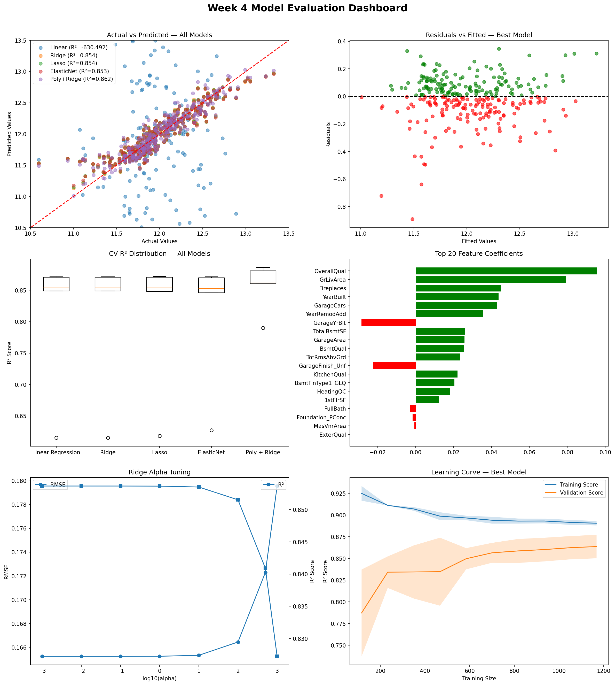

# 🏠 House Prices Prediction using Regression Models

A complete machine learning regression project developed as part of the **AI/ML Internship — Week 4 Task**. This project focuses on predicting house prices using multiple regression algorithms, advanced preprocessing techniques, feature engineering, regularization methods, and detailed model evaluation strategies. The project follows a complete machine learning workflow from data preparation to model deployment preparation.

---

# 👨‍💻 Author

**Bisma Imran**  
AI/ML Internship — Week 4  
Supervised Learning — Regression Analysis

---

# 📌 Project Overview

The primary goal of this project is to build accurate and reliable machine learning models for predicting house prices. Different regression techniques were implemented and compared to understand how regularization, feature engineering, and model complexity affect prediction performance.

The project includes:

- Data preprocessing and cleaning
- Feature engineering and encoding
- Regression model training
- Hyperparameter tuning using GridSearchCV
- Cross-validation analysis
- Residual diagnostics
- Learning curve analysis
- Regularization comparison
- Model evaluation and visualization
- Prediction analysis and model saving

The project also focuses heavily on understanding model behavior, overfitting, underfitting, and the impact of preprocessing techniques on machine learning performance.

---

# 📂 Dataset Information

The project uses the **House Prices Dataset**, which contains different numerical and categorical features describing residential properties. The target variable for prediction is `SalePrice`.

### Dataset Details

| Attribute | Description |
|---|---|
| Dataset Type | Structured Tabular Dataset |
| Problem Type | Supervised Machine Learning — Regression |
| Target Variable | `SalePrice` |
| Environment Used | Google Colab |
| Programming Language | Python |

The dataset contains features related to house quality, living area, basement information, garage capacity, construction year, and neighborhood information. These variables were used to train machine learning models capable of estimating property prices.

---

# ⚙️ Feature Engineering & Preprocessing

A complete preprocessing pipeline was developed during Week 3 and reused in Week 4 for regression modeling. Proper preprocessing played a major role in improving model accuracy and stability.

The preprocessing workflow included:

- Handling missing values using median and mode imputation
- Standardizing column names
- Ordinal quality encoding for quality-related features
- One-hot encoding for categorical variables
- Frequency encoding for the `Neighborhood` feature
- Correlation-based feature selection
- Log transformation of `SalePrice`
- Feature scaling using `StandardScaler`

Several important engineered features significantly improved model performance, especially variables related to overall house quality, living area, basement size, and garage information.

---

# 🤖 Regression Models Implemented

Multiple regression algorithms were trained and evaluated to compare their performance and generalization ability.

### Models Used

1. Linear Regression
2. Ridge Regression
3. Lasso Regression
4. ElasticNet Regression
5. Polynomial + Ridge Pipeline

Each model was evaluated using training metrics, test metrics, cross-validation, residual analysis, and learning curve interpretation.

---

# 📊 Evaluation Metrics

To measure model performance accurately, multiple regression evaluation metrics were used throughout the project.

### Metrics Used

- Mean Absolute Error (MAE)
- Mean Squared Error (MSE)
- Root Mean Squared Error (RMSE)
- R² Score
- Adjusted R²
- Mean Absolute Percentage Error (MAPE)
- Cross-Validation Scores

These metrics helped compare model accuracy, stability, and generalization performance across different regression techniques.

---

# 🏆 Best Performing Model

## Polynomial + Ridge Pipeline

Among all trained models, the **Polynomial + Ridge Pipeline** achieved the best overall performance. The model successfully captured nonlinear relationships between important housing features while controlling overfitting using Ridge regularization.

### Best Model Results

| Metric | Score |
|---|---|
| Test R² Score | 0.8616 |
| RMSE | 0.1607 |
| Adjusted R² | 0.8514 |
| MAPE | 0.95% |

The Polynomial + Ridge model also achieved the best cross-validation performance and demonstrated strong generalization ability on unseen data.

---

# 📈 Important Features Influencing House Prices

Feature importance analysis showed that several housing-related variables consistently had the strongest impact on house price prediction.

### Most Influential Features

- OverallQual
- GrLivArea
- TotalBsmtSF
- GarageCars
- GarageArea
- KitchenQual
- BsmtQual
- YearBuilt
- FullBath

These features represent overall property quality, living space, basement area, garage capacity, and construction quality, which naturally play a major role in determining house prices.

---

# 📉 Analysis & Visualizations Performed

A wide range of regression analysis techniques and visualizations were implemented during the project to better understand model behavior and performance.

### Key Analyses Included

- Polynomial Regression degree comparison
- Ridge alpha tuning analysis
- Lasso feature elimination analysis
- ElasticNet parameter optimization
- Residual diagnostic plots
- Learning curve analysis
- Cross-validation comparison
- Regularization coefficient path visualization
- Prediction error analysis
- Final 6-chart evaluation dashboard

These analyses helped identify the most stable and accurate model while also providing insights into overfitting, feature importance, and residual behavior.

---

# 📊 Final Dashboard

The project includes a complete professional dashboard containing six different evaluation charts for comparing model performance and diagnostics.

### Dashboard Includes

- Actual vs Predicted comparison
- Residual analysis visualization
- Cross-validation box plots
- Feature coefficient analysis
- Ridge alpha tuning graph
- Learning curves for best model

## Dashboard Preview



---

# 💾 Model Saving & Reloading

The final trained model was saved using `Joblib` to allow future predictions and deployment.

```python
import joblib

joblib.dump(best_pipeline_model, 'week4_best_model.pkl')
```

The saved model was successfully reloaded and verified using sample predictions to ensure that the deployment pipeline works correctly.

---

# 🛠️ Technologies & Libraries Used

The project was developed using Python and several machine learning and visualization libraries.

### Libraries Used

- Python
- Pandas
- NumPy
- Matplotlib
- Seaborn
- Scikit-learn
- SciPy
- Joblib

These libraries were used for preprocessing, feature engineering, regression modeling, visualization, hyperparameter tuning, and model persistence.

---

# 📁 Repository Structure

```text
├── Week4_Regression_Analysis.ipynb
├── week4_dashboard.png
├── week4_best_model.pkl
├── README.md
```

---

# ✅ Conclusion

This project demonstrates a complete regression-based machine learning workflow for house price prediction using multiple supervised learning techniques. Different regression and regularization models were implemented, compared, and analyzed using multiple evaluation strategies and diagnostic techniques.

The results showed that preprocessing, feature engineering, regularization, and hyperparameter tuning significantly improve model performance. Among all evaluated models, the Polynomial + Ridge Pipeline achieved the best balance between prediction accuracy, stability, and generalization performance, making it the most suitable model for deployment in real-world housing price prediction tasks.
